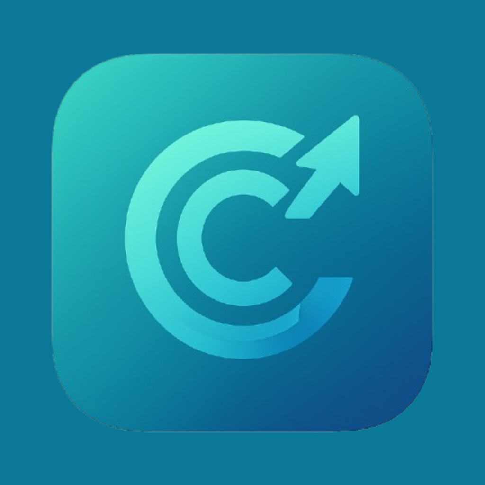
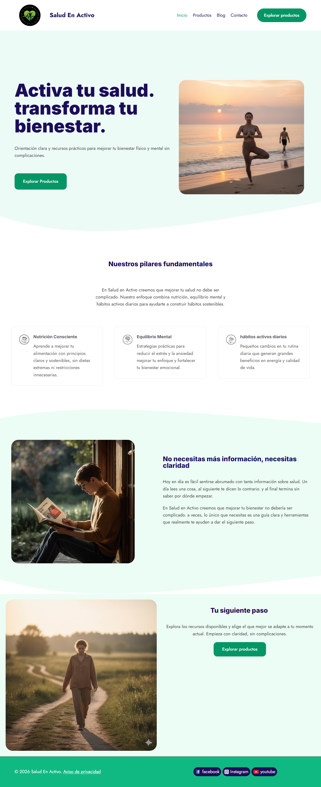
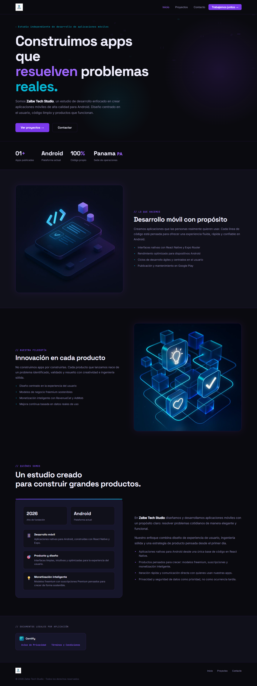

  

<h1 align="center">Hi, I'm Abel Gonzalez 👋</h1>
<h3 align="center">Web & Mobile Developer · Founder @ Zalbe Tech Studio</h3>

  

  I design and build web and mobile products from the ground up — from concept and architecture to launch and maintenance. 
  Based in Panama 🇵🇦, working independently under <strong>Zalbe Tech Studio</strong>, my own development studio focused on clean code, purposeful design, and real results.

---

### 🚀 What I'm building

My current main project is **Centify**, a personal finance management app for Android. It grew from a simple idea into a full product with multi-account tracking, category-based budgeting, savings goals, PDF report exports, a push notification system, and a customizable theme engine — all built solo. Releasing on Google Play soon.

In parallel, I work on custom web projects: sites that are fast, accessible, and built to rank — not just to look good.

---

### 🛠️ Tech stack

  
  
  
  
  
  
  
  

---

### 📂 Featured Projects

---

#### 📱 Centify — Personal Finance App for Android

  
  
  
  
  

A complete personal finance manager built natively for Android with React Native and Expo Router. Designed for users who want real control over their money without complexity.

**Key features:**
- 💰 Income and expense tracking across 63+ categories
- 📊 Monthly budgets, savings goals, and balance overview
- 📄 PDF report export with one tap
- 🔔 Custom push notification reminders
- 🎨 Fully themeable interface with dark mode
- 🏆 Achievements system to build healthy financial habits
- 💎 Freemium model — free tier with ads, Premium via subscription (RevenueCat)

> Built entirely solo: product design, UI/UX, business logic, monetization, and release strategy.

🔒 Private repository · **Google Play release coming soon**

---

#### 🌿 Salud En Activo — Health & Wellness Platform

  
  
  
  
  

A health and wellness website built to educate and convert. The site covers three core pillars — nutrition, mental balance, and daily active habits — with a product section, blog, and contact flow designed to guide visitors toward taking action.

**What went into it:**
- Clean, accessible layout with a focus on readability and trust
- SEO-optimized structure: semantic HTML, meta tags, fast load times
- Conversion-focused sections: clear calls to action, product highlights, and social proof
- Responsive design that works across all screen sizes and devices
- Contact and blog sections built for long-term content growth

> 🌐 **[Visit saludenactivo.com](https://saludenactivo.com/)**

---

#### ⚡ Zalbe Tech Studio — Developer Studio Website

  
  
  
  
  

The official website for Zalbe Tech Studio. A single-file, single-page application with hash-based routing that covers the studio's identity, published projects, a working contact form, and the legal documentation for all published apps.

**Technical highlights:**
- Hash-based SPA routing — each section has a unique, shareable URL (`#projects`, `#privacy`, `#terms`)
- Contact form integrated with Web3Forms and protected with hCaptcha
- Legal pages (Privacy Policy and Terms of Use) hosted and linked directly from the app
- Fully responsive dark UI with particle animations and smooth page transitions
- No frameworks, no dependencies — pure HTML, CSS, and vanilla JavaScript

> 🌐 **[Visit Zalbe Tech Studio](https://zalbetechstudio.saludenactivo.com/)** *(update with your domain)*

---

### 📫 Get in touch

I'm open to freelance web and mobile development projects. Whether you need a fast, well-structured website or a custom Android app built from scratch, feel free to reach out — I keep things direct and straightforward.

  
  &nbsp;
  

---

<em>Three projects built. More in progress.</em>

